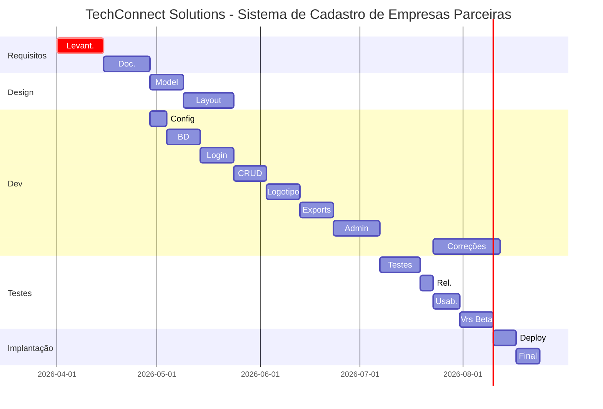
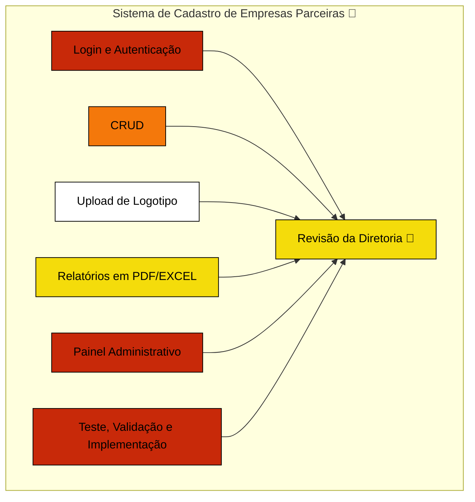

```mermaid
gantt
    title TechConnect Solutions - Sistema de Cadastro de Empresas Parceiras
    dateFormat YYYY-MM-DD
    
    section Requisitos
    Levant.                    :crit, req, 2026-04-01, 14d
    Doc.                       :doc, after req, 14d
    
    section Design
    Model                      :mod, after doc, 10d
    Layout                     :lay, after mod, 15d
    
    section Dev
    Config                     :cfg, after doc, 5d
    BD                         :bd, after cfg, 10d
    Login                      :lgn, after bd, 10d
    CRUD                       :crd, after lgn, 10d
    Logotipo                   :lgt, after crd, 10d
    Exports                    :exp, after lgt, 10d
    Admin                      :adm, after exp, 14d
    Correções                  :cor, after rel, 20d
    
    section Testes
    Testes                      :tst, after adm, 12d
    Rel.                        :rel, after tst, 4d
    Usab.                       :usb, after rel, 8d
    Vrs Beta                    :beta, after usb, 10d
    
    section Implantação
    Deploy                      :deploy, after beta, 7d
    Final                       :entrega, after deploy, 7d
```

```mermaid
graph TD

    classDef white color:#000, fill:#FFF, stroke:#000, stroke-width:1px;
    classDef yellow color:#000, fill:#F4DC0B, stroke:#000, stroke-width:1px;
    classDef orange color:#000, fill:#F4780B, stroke:#000, stroke-width:1px;
    classDef red color:#000, fill:#C82909, stroke:#000, stroke-width:1px;

    subgraph "Sistema de Cadastro de Empresas Parceiras 🤝"
        A1["Login e Autenticação"]:::red-->             B1
        A2["CRUD"]:::orange-->                          B1
        A3["Upload de Logotipo"]:::white-->             B1
        A4["Relatórios em PDF/EXCEL"]:::yellow-->       B1
        A5["Painel Administrativo"]:::red-->            B1
        A6["Teste, Validação e Implementação"]:::red--> B1

        B1["Revisão da Diretoria 📖"]:::yellow
    end
```
