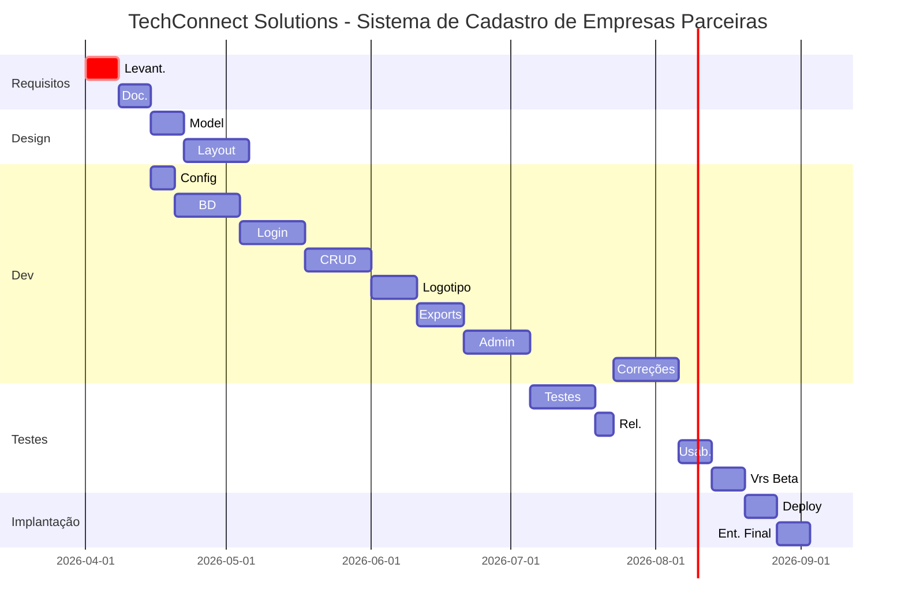

```mermaid
gantt
    title TechConnect Solutions - Sistema de Cadastro de Empresas Parceiras
    dateFormat YYYY-MM-DD
    
    section Requisitos
    Levant.                    :crit, req, 2026-04-01, 7d
    Doc.                       :doc, after req, 7d
    
    section Design
    Model                      :mod, after doc, 7d
    Layout                     :lay, after mod, 14d
    
    section Dev
    Config                     :cfg, after doc, 5d
    BD                         :bd, after cfg, 14d
    Login                      :lgn, after bd, 14d
    CRUD                       :crd, after lgn, 14d
    Logotipo                   :lgt, after crd, 10d
    Exports                    :exp, after lgt, 10d
    Admin                      :adm, after exp, 14d
    Correções                  :cor, after rel, 14d
    
    section Testes
    Testes                      :tst, after adm, 14d
    Rel.                        :rel, after tst, 4d
    Usab.                       :usb, after cor, 7d
    Vrs Beta                    :beta, after usb, 7d
    
    section Implantação
    Deploy                      :deploy, after beta, 7d
    Ent. Final                  :entrega, after deploy, 7d
```
