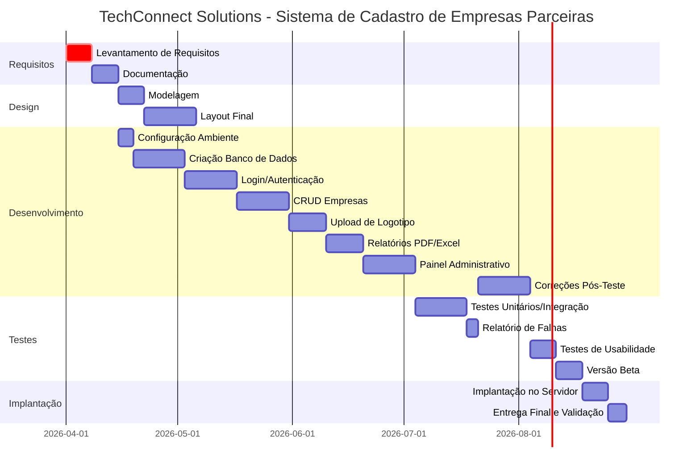

```mermaid
gantt
    title TechConnect Solutions - Sistema de Cadastro de Empresas Parceiras
    dateFormat YYYY-MM-DD
    
    section Requisitos
    Levantamento de Requisitos :crit, req, 2026-04-01, 7d
    Documentação               :doc, after req, 7d
    
    section Design
    Modelagem                   :mod, after doc, 7d
    Layout Final                :lay, after mod, 14d
    
    section Desenvolvimento
    Configuração Ambiente      :cfg, after doc, 4d
    Criação Banco de Dados     :bd, after cfg, 14d
    Login/Autenticação         :lgn, after bd, 14d
    CRUD Empresas              :crd, after lgn, 14d
    Upload de Logotipo         :lgt, after crd, 10d
    Relatórios PDF/Excel       :exp, after lgt, 10d
    Painel Administrativo      :adm, after exp, 14d
    Correções Pós-Teste        :cor, after rel, 14d
    
    section Testes
    Testes Unitários/Integração :tst, after adm, 14d
    Relatório de Falhas         :rel, after tst, 3d
    Testes de Usabilidade       :usb, after cor, 7d
    Versão Beta                 :beta, after usb, 7d
    
    section Implantação
    Implantação no Servidor     :deploy, after beta, 7d
    Entrega Final e Validação   :entrega, after deploy, 5d
```
