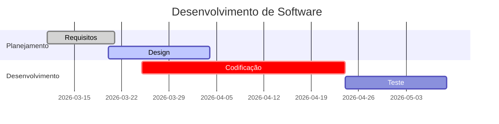

```mermaid
  gantt
  %%%Definir título principal
  title Desenvolvimento de Software

  %%%Definir o formato data (Ano-Mês-Dia)
  dateFormat YYYY-MM-DD

  %%%Criação do agrupamento visual para as tarefas iniciais
  section Planejamento

  %%%'done': 'tarefa concluída(fica cinza)', 'req': 'id da tarefa', '2026-03-11': 'data de início', '10d': 'duração'
  Requisitos :done, req, 2026-03-11, 10d

  %%%'active': 'tarefa em andamento'
  Design :active, des, 2026-03-20, 15d

  %%%Criação do segundo bloco
  section Desenvolvimento

  %%%'crit': 'define como tarefa crítica (cor vermelha ou destaque)'
  Codificação :crit, dev, 2026-03-25, 30d

  %%%'after dev': 'realiza a tarefa quando a tarefa dev terminar'
  Teste :test, after dev, 15d
  
```
